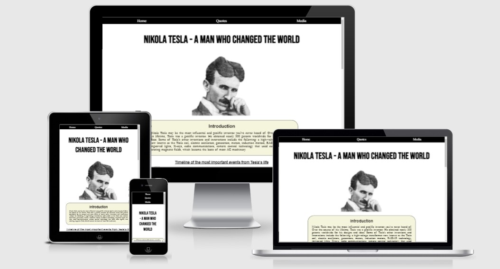
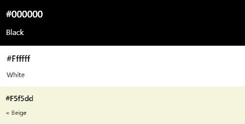

# Nikola Tesla 
This is a website dedicated to a famous scientist Nikola Tesla and it primarily aims to provide vital information about his life to all visitors, 
especially ones interested in history and science. This website has three pages: home, quotes and media, thus providing variety of possibilities 
for visitors to inform themselves about Nikola Tesla.

The deployed website can be viewed here. [Nikola Tesla](https://jurica29.github.io/Nikola-Tesla/).

## UX
### User Stories
+ As a user, I want to…
1.	be able to navigate the website easily.
2.	be able to get the most important information about Tesla's work and life.
3.	be able to understand why is Tesla so important for the history of science.
4.	be able to use variety of options to inform myself, from textual to audiovisual resources.
+ As a site owner, I want…
1.	the information to be clear and informative.
2.	the information to be sufficiently various for all users.
3.	the website be simple to navigate.

### 1. Strategy 
 * Project Purpose
    *    To provide the most important pieces of information about Nikola Tesla.
    * 	 To educate people about his importance in history of science.

### 2. Scope
 * I wanted a simple, straightforward UX experience.
 * I wanted my content to be clear for all users. 
 * A site that is visually appealing on most devices.
 * Information about:
     *  Tesla's life and work.

### 3. Structure
*	A clear layout is in place to ensure users can immediately find all the information.
*	The navbar is clean and simple with distinguished spacing between each of elements, which allows for easy and simple navigation.	
*	The Home page is containing an introductory text and a timeline with most important information from Tesla's life. 
*	The Quotes page provides interesting Tesla's quotes which provide deeper understanding of him as a person and scientist.
*	The Media page contains documentaries and videos about Tesla.
*	At the bottom of all pages users can find newsletter subscription form requiring email input.
*	In the Footer, users can find social media buttons.

### 4. Skeleton
Wireframes created with Balsamiq. The project was developed from initial wireframes and slight modifications were made during the development process to assure better usability. 

Click on the below page names to see these wireframes:

[Home](https://github.com/jurica29/Project-1/blob/4ae3f1fbf933a4cb1b795c88946703d83e6a17c4/assets/images/readmeimages/home.jpg)

[Quotes](https://github.com/jurica29/Project-1/blob/4ae3f1fbf933a4cb1b795c88946703d83e6a17c4/assets/images/readmeimages/quotes.jpg)

[Media](https://github.com/jurica29/Project-1/blob/4ae3f1fbf933a4cb1b795c88946703d83e6a17c4/assets/images/readmeimages/media.jpg)

### 5. Surface
* Colours

When considering the colour theme of this project the objective was to use black and white theme in accordance with the main subject of the website. Also, beige is used for certain elements, such as text, title and timeline boxes.

* Font Selection
 
Title font, "Bebas Neue", was chosen from [Google Fonts](https://fonts.google.com/), while there were two default fonts used across the website: Garamond (for headers) and Arial (for paragraphs).

## Existing Features 

+ The home page image

Tesla's portrait photo is used at the home page.

+ Navigation Bar 

 Featured on all three pages, the full responsive navigation bar includes links to the Home page, Quotes and Media page and is identical in each page to allow for easy navigation.

